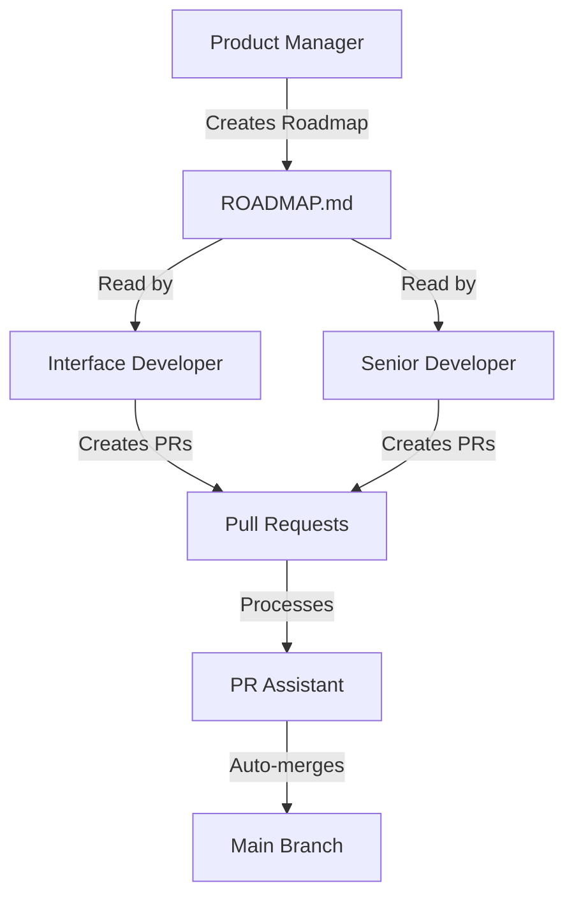

[](https://github.com/juninmd/github-assistance/actions/workflows/security-scanner.yml)

# Development Team Agents

> **Automated development team powered by Jules AI and GitHub Actions**

A modular system of AI agents that work together to manage, develop, and maintain software projects automatically.

## 🤖 Meet the Team

### Product Manager Agent
**Persona**: Strategic product thinker
**Mission**: Create and maintain product roadmaps, prioritize features, ensure development aligns with product vision
**Schedule**: Daily at 9:00 AM UTC

**Responsibilities**:
- Analyze repository goals and user feedback
- Generate detailed roadmap documents
- Prioritize features based on impact and effort
- Ensure work aligns with project vision

### Interface Developer Agent
**Persona**: Creative frontend developer
**Mission**: Build beautiful, accessible, and performant UIs using modern tools and MCP Stitch
**Schedule**: Daily at 11:00 AM UTC

**Responsibilities**:
- Develop and enhance user interfaces
- Use MCP Stitch for rapid prototyping
- Ensure accessibility and performance
- Create component libraries and design systems

### Senior Developer Agent
**Persona**: Experienced software engineer focused on quality
**Mission**: Implement features with emphasis on security, testing, and CI/CD
**Schedule**: Daily at 1:00 PM UTC

**Responsibilities**:
- Implement features from roadmaps
- Ensure code security (OWASP guidelines)
- Set up CI/CD pipelines
- Maintain .gitignore and secrets management
- Generate executables and installers

### PR Assistant Agent
**Persona**: Meticulous code reviewer
**Mission**: Verify and automatically merge pull requests that meet quality standards
**Schedule**: Every 30 minutes
**Scope**: **ALL repositories** owned by juninmd (not limited by allowlist)

**Responsibilities**:
- Monitor and process pull requests across all repositories
- Resolve merge conflicts automatically
- Auto-merge PRs that pass all checks
- Request corrections when pipeline checks fail
- **NEW**: Automatically accept code review suggestions from Google bot (Jules)
- **NEW**: Enforce 10-minute minimum PR age before auto-merge

### Security Scanner Agent
**Persona**: Security-focused automation expert
**Mission**: Scan repositories for exposed credentials and secrets using gitleaks
**Schedule**: Daily at 6:00 AM UTC
**Scope**: **ALL repositories** owned by juninmd (not limited by allowlist)

**Responsibilities**:
- Scan all repositories for exposed credentials, API keys, passwords
- Use gitleaks to detect various types of secrets
- Generate sanitized security reports (no actual secret values exposed)
- Send detailed reports via Telegram with metadata only
- Enable proactive security management

**Security Features**:
- Silent execution suitable for public repositories
- Never exposes actual secret values in logs or reports
- Reports include: repository, file path, line number, secret type
- NEVER includes: actual credentials, secret content, or partial reveals

## 🏗️ Architecture

```
pull-request-assistance/
├── src/
│   ├── agents/              # Agent implementations
│   │   ├── base_agent.py    # Base class for all agents
│   │   ├── product_manager/
│   │   ├── interface_developer/
│   │   ├── senior_developer/
│   │   ├── pr_assistant/
│   │   └── security_scanner/
│   ├── jules/               # Jules API integration
│   │   └── client.py
│   ├── config/              # Configuration management
│   │   ├── settings.py
│   │   └── repository_allowlist.py
│   ├── github_client.py     # GitHub API client

│   └── run_agent.py         # Agent runner
├── config/
│   └── repositories.json    # Repository allowlist
├── .github/
│   └── workflows/           # GitHub Actions workflows
│       ├── product-manager.yml
│       ├── interface-developer.yml
│       ├── senior-developer.yml
│       ├── pr-assistant.yml
│       └── security-scanner.yml
└── logs/                    # Agent execution logs
```

## 🚀 Setup

### 1. Configure GitHub Secrets

Add the following secrets to your GitHub repository:

- `JULES_API_KEY`: Your Jules API key
- `GITHUB_TOKEN`: Automatically provided by GitHub Actions
- `TELEGRAM_BOT_TOKEN`: (Optional) For notifications
- `TELEGRAM_CHAT_ID`: (Optional) For notifications

### 2. Configure Repository Allowlist

Edit `config/repositories.json` to specify which repositories the agents can work on:

```json
{
  "repositories": [
    "juninmd/my-project",
    "juninmd/another-project"
  ],
  "description": "List of repositories that agents are allowed to work on"
}
```

### 3. Install Dependencies

```bash
# Install all dependencies including dev tools
uv sync --all-extras
```

## 🔧 Development

### Code Quality Tools

This project uses the following tools to ensure code quality:

- **Ruff**: Fast Python linter for code quality checks
- **Pyright**: Static type checker for Python

### Running Code Quality Checks

```bash
# Run linting
uv run ruff check src tests

# Run type checking
uv run pyright

# Or use the convenience script
./scripts/lint.sh
```

### Fixing Linting Issues

```bash
# Auto-fix linting issues where possible
uv run ruff check --fix src tests
```

## 📖 Usage

### Running Agents Locally

Run individual agents:

```bash
# Product Manager
uv run run-agent product-manager

# Interface Developer
uv run run-agent interface-developer

# Senior Developer
uv run run-agent senior-developer

# PR Assistant
uv run run-agent pr-assistant

# Security Scanner
uv run run-agent security-scanner

# All agents sequentially
uv run run-agent all
```

### Environment Variables

Required for all agents:
- `GITHUB_TOKEN`: GitHub personal access token
- `JULES_API_KEY`: Jules API key
- `GITHUB_OWNER`: GitHub username (default: juninmd)

Optional:
- `TELEGRAM_BOT_TOKEN`: For notifications
- `TELEGRAM_CHAT_ID`: For notifications
- `REPOSITORY_ALLOWLIST_PATH`: Custom path to allowlist file

### GitHub Actions Workflows

Agents run automatically on schedule via GitHub Actions:

- **Product Manager**: Daily at 9:00 AM UTC
- **Interface Developer**: Daily at 11:00 AM UTC
- **Senior Developer**: Daily at 1:00 PM UTC
- **PR Assistant**: Every 30 minutes (all repositories)
- **Security Scanner**: Daily at 6:00 AM UTC (all repositories)

You can also trigger workflows manually:
1. Go to Actions tab in GitHub
2. Select the workflow
3. Click "Run workflow"

## 🔐 Security

**IMPORTANT**: Never commit secrets or API keys to the repository.

1. Add all secrets as GitHub Secrets
2. Use .gitignore to prevent accidental commits
3. Rotate keys periodically
4. Limit permissions to only what's needed

## 🔄 Workflow



## 📊 Monitoring

Execution results are saved as JSON files in the `logs/` directory:

- `product-manager-YYYYMMDD_HHMMSS.json`
- `interface-developer-YYYYMMDD_HHMMSS.json`
- `senior-developer-YYYYMMDD_HHMMSS.json`
- `pr-assistant-YYYYMMDD_HHMMSS.json`
- `security-scanner-YYYYMMDD_HHMMSS.json`

These are also uploaded as GitHub Actions artifacts (retained for 30 days).

## 🧪 Testing

```bash
pytest tests/
```

## 📝 Adding New Agents

1. Create a new directory in `src/agents/<agent_name>/`
2. Create `agent.py` inheriting from `BaseAgent`
3. Implement required properties: `persona`, `mission`
4. Implement `run()` method
5. Add entry in `src/run_agent.py`
6. Create GitHub Actions workflow in `.github/workflows/`

## 🤝 Contributing

1. Fork the repository
2. Create a feature branch
3. Make your changes
4. Run tests
5. Submit a pull request

## 📄 License

MIT License - See LICENSE file for details

## � Documentation

- [AGENTS.md](AGENTS.md) - Complete agent instructions and workflow
- [ARCHITECTURE.md](ARCHITECTURE.md) - Technical architecture
- [SECRETS_SETUP.md](SECRETS_SETUP.md) - How to configure secrets
- [QUICKSTART.md](QUICKSTART.md) - Quick start guide
- [TROUBLESHOOTING.md](TROUBLESHOOTING.md) - Common issues and solutions

## 🔗 Resources

- [Jules API Documentation](https://jules.google/docs/api/reference/)
- [GitHub Actions Documentation](https://docs.github.com/en/actions)
- [PyGithub Documentation](https://pygithub.readthedocs.io/)

## 📞 Support

For issues or questions:

1. **Check [TROUBLESHOOTING.md](TROUBLESHOOTING.md)** for common issues
2. Open an issue on GitHub
3. Contact: agent@juninmd.com

---

**Built with ❤️ by the AI Development Team**
See `AGENTS.md` for specific rules regarding "Jules da Google".
